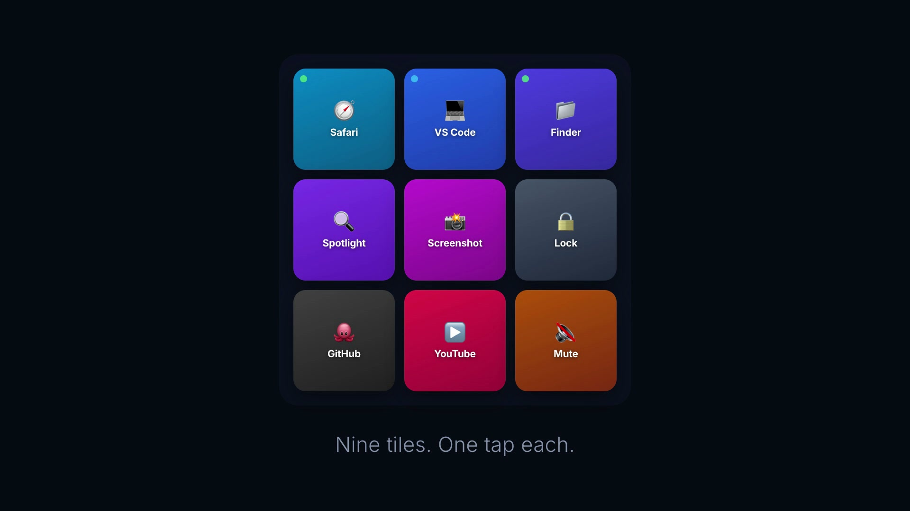
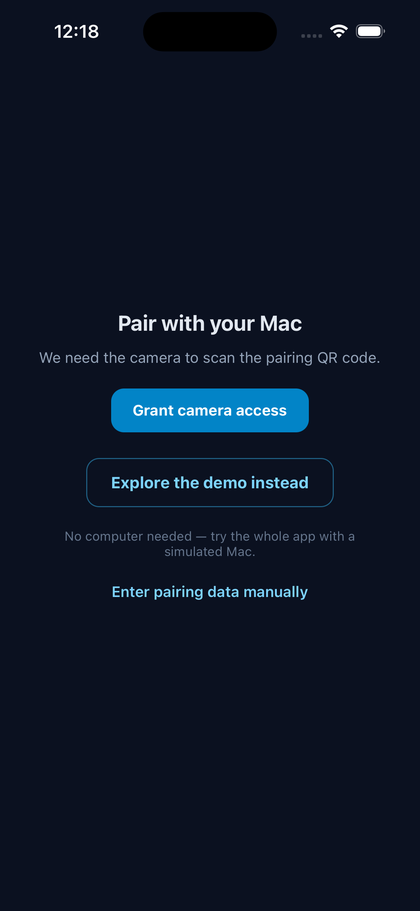
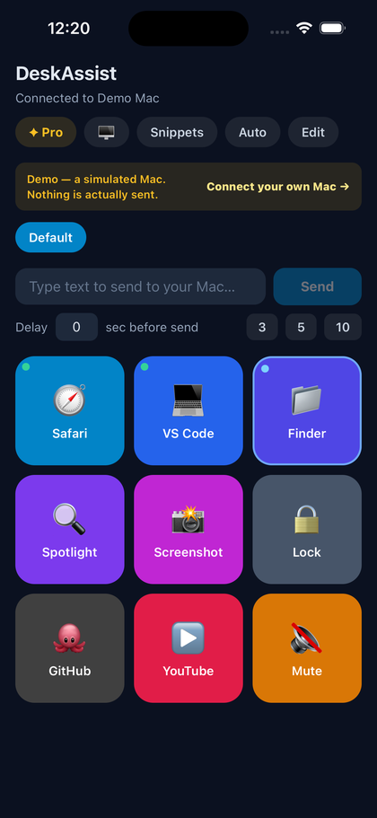
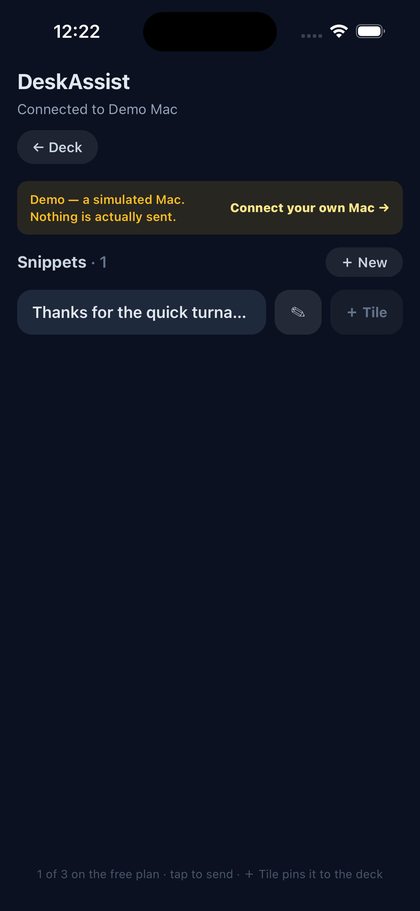

<div align="center">


# DeskAssist

### Your phone is the button.

Tap a tile on your phone and your Mac **launches an app, opens a URL, fires a
keyboard shortcut, or types saved text** — in real time, over your own Wi-Fi, on
an **end-to-end encrypted** link you set up by scanning a QR code.

[](docs/demo.mp4)

<sub>▶︎ **Click the image to play the demo** (20s, with sound)</sub>

</div>

---

## Reviewing this project? Start here

**You don't need a Mac and you don't need an account.** Open the app and tap
**"Explore the demo instead"** on the first screen — the whole thing runs against
a simulated Mac. The deck responds, the running-apps list fills, Auto mode
reacts to a rotating focused app, and snippets report their result. That mode
exists in [`mobile/src/demo.ts`](mobile/src/demo.ts).

A guided tour of the parts worth reading, shortest path first:

| What | Where | Why it's interesting |
| --- | --- | --- |
| **The pairing handshake** | [`mobile/src/crypto.ts`](mobile/src/crypto.ts) · [`SECURE-PAIRING-PLAN.md`](SECURE-PAIRING-PLAN.md) | Ephemeral X25519 → HKDF → HMAC confirmation. The QR carries a public key, never a secret. |
| **The sealed transport** | [`mobile/src/rpc.ts`](mobile/src/rpc.ts) | AES-256-GCM per command with a monotonic counter, so tampering fails the tag and replays are rejected. |
| **The one demo/real switch** | [`mobile/src/host.ts`](mobile/src/host.ts) | Single dispatch point. The branch happens *before* any sealing, so no demo path can reach the crypto. |
| **Monetization** | [`mobile/src/purchases.ts`](mobile/src/purchases.ts) | RevenueCat entitlement as the only source of truth — no local "isPro" flag to drift. |
| **OS execution** | [`desktop/src/executor.mjs`](desktop/src/executor.mjs) | Where taps become `open -a`, AppleScript keystrokes, or a blocked shell call. |

Three decisions that explain most of the codebase:

1. **A browser can't control an OS.** Hence a separate Node/Electron host process,
   and hence a real cryptographic handshake between two devices instead of a
   login. See [How it works](#how-it-works).
2. **No server of ours is in the path.** No account, no relay, no analytics SDK.
   The phone talks to the computer and to nothing else — which is what makes it
   defensible to give an app the ability to type into your windows.
3. **Arbitrary code execution is opt-in.** `shell` actions ship disabled behind a
   deliberate toggle, enforced in one function. See [Security](#security).

---

## Free vs Pro

Monetized with [RevenueCat](https://www.revenuecat.com/) — one entitlement
(`deskassist_pro`) and a `default` offering with monthly, annual and lifetime
packages. Entitlement state is always read from RevenueCat's `CustomerInfo`
rather than a local flag, so lapses, refunds and restores on a second device
resolve correctly with no logic of our own.

| | Free | Pro |
| --- | --- | --- |
| Profiles | 1 | Unlimited |
| Pages per profile | 1 (nine tiles) | Unlimited |
| Snippets | 3 | Unlimited |
| Image tile faces | — | ✓ |

**The wall sits in front of growth, never in front of function.** All five action
types — app, URL, keyboard shortcut, text, shell — are free, as is unlimited
ad-hoc text sending. A free user gets a fully working Stream Deck, and nothing
that works on day one ever stops working.

Two deliberate choices: free gets **three** snippets rather than none, because a
feature nobody can try is a feature nobody buys; and **Auto mode is free but
self-limiting** — it switches decks to match your focused app, which does
nothing useful with one profile, so the feature creates the want by working
rather than by showing a lock.

The paywall is reason-aware — reaching for a second profile says "One deck isn't
enough", a fourth snippet says "Room for every snippet" — implemented in
[`mobile/src/Paywall.tsx`](mobile/src/Paywall.tsx).

---

## What it looks like

<p align="center">
  
  
  
</p>
<p align="center">
  <sub><b>Pair once</b> · <b>nine tiles, one tap each</b> · <b>snippets that type themselves</b></sub>
</p>

### Demo mode

**No computer to hand?** Tap **Explore the demo** on the pairing screen and the
whole app runs against a simulated Mac — no install, no pairing, no network. It
exists so anyone can evaluate the product without owning the other half of it.

---

## How it works

Three parts. The phone is the surface, the Mac app is the executor, and nothing
in between touches a server you don't own.

```
native phone app  ──AES-256-GCM over your LAN──▶  macOS host app  ──▶  macOS / Windows
   scan QR to pair       per-device key, X25519 handshake,           tray + pairing window
                         monotonic replay counter
```

| Part | What it is | Tech | Folder |
| --- | --- | --- | --- |
| **Phone app** | Native iOS/Android deck — scans a QR to pair; editable, **resizable** grid of tiles | Expo / React Native (TS) | [`mobile/`](mobile/) |
| **Desktop host** | Menu-bar/tray app that pairs with the phone and runs the actions | Electron + electron-builder | [`desktop/`](desktop/) |

> There's also a **legacy browser-based deck** (Next.js), archived under
> [`Extras/legacy-web-deck/`](Extras/legacy-web-deck/) — the original version. It
> still works but is superseded by the native app + desktop host. See
> [Legacy web deck](#legacy-web-deck).

### Action types

| Type | Example | What it does | Platforms |
| --- | --- | --- | --- |
| `app` | `{ type: "app", target: "Safari" }` | Launch/focus an app | macOS · Windows · Linux |
| `url` | `{ type: "url", target: "https://github.com" }` | Open a URL | all |
| `keys` | `{ type: "keys", combo: "cmd+shift+4" }` | Send a keyboard shortcut | macOS · Windows |
| `text` | `{ type: "text", text: "Hello!" }` | Type a literal string into the focused app | macOS · Windows |
| `shell` | `{ type: "shell", command: "…" }` | Run a shell command | all |

`keys` and `text` synthesize keystrokes (macOS AppleScript `System Events` /
Windows PowerShell `SendKeys`) and need **macOS Accessibility permission**.

---

## Deck features

The deck is fully editable on the device — no code, no config files.

- **Profiles** — group tiles into named decks (Work, Design, Home…) and switch
  with a tap. Each profile is its own layout, saved per device.
- **Pages** — each profile holds multiple **pages of up to 9 tiles**; flip
  between them with the dots/arrows below the grid, add/remove pages in edit mode.
- **🪄 Intuitive (Auto) mode** — the active profile **follows the app you're
  focused on**. Map apps → profiles (with a "Use current app" shortcut); it's
  edge-triggered, and an unmapped app leaves the deck where it is.
- **Running-apps screen** — a live list of what's open on the host: tap to bring
  an app to the front, or **＋** to pin it as a tile.
- **Live tile state** — `app` tiles light up when that app is running and
  highlight the one that's frontmost.
- **Snippet library** — saved text, sent with one tap; pin any snippet as a tile.
- **Custom tile faces** — give a tile an **emoji**, short **text** (REC, 1, GG),
  or an **uploaded image** (resized and stored on-device).
- **Drag to reorder**, resize the grid (2–5 columns) and individual tiles
  (2×1, 2×2…), plus icon/color quick-picks in the tile editor.

macOS-only for now: focus detection (Auto mode) and the running-apps list.

---

## Security

Pairing is **forward-secret** and the channel is authenticated + encrypted, so an
attacker on the same Wi-Fi can't read, forge, replay, or hijack it:

- The QR carries only an **ephemeral X25519 public key** (no secret). The phone
  does ECDH + HKDF to derive a per-device key; an HMAC confirmation proves it saw
  the QR (blocks pairing hijacks).
- Every message is an **AES-256-GCM** envelope with a **monotonic counter** — any
  tamper fails the tag, any replay is rejected.
- Each phone gets its own key and is individually revocable (Unpair).

**`shell` commands are opt-in.** A `shell` tile runs arbitrary commands on the
host, so it's **disabled by default** and only runs when the operator explicitly
enables it:

- **Desktop app**: tray menu → *Allow shell commands* (a confirmation dialog
  guards it; the setting persists per host).
- **Node agent / headless host**: start with `DECK_ALLOW_SHELL=1`.

Optionally restrict *which* commands run, even when enabled, with an exact-match
allowlist: `DECK_SHELL_ALLOWLIST="cmd one,cmd two"` for the agent (or a
`shellAllowlist` array in the host's `settings.json`). With shell disabled, a
paired phone (or a leaked token) still cannot execute code on your machine.

Full protocol + threat model: [`SECURE-PAIRING-PLAN.md`](SECURE-PAIRING-PLAN.md).

---

## Pair & use

1. On the Mac: launch DeskAssist → click **Pair a phone** (shows a QR).
2. On the phone: open the app → **scan the QR** with the camera.
3. You land on the deck. Tap tiles to fire actions, or use the **Send text** bar
   (with an optional countdown delay) to type onto your computer. In **Edit** mode
   you can add/edit/delete and **drag to reorder** tiles, add **pages** and
   **profiles**, set the layout size (2–5 columns) and resize tiles. Turn on
   **🪄 Auto** to have the profile follow your focused app, or open **Apps** to
   focus/pin what's running.

Both devices must be on the **same Wi-Fi**. On iOS, allow the **Local Network**
permission prompt.

---

## Download

| | Platform | |
| --- | --- | --- |
| 🖥️ | **macOS host app** — the half that does the work | [**Download the `.dmg`**][latest-release] |
| 📱 | **iPhone app** | App Store — *coming soon* |
| 🧪 | **No Mac to hand?** | Tap **Explore the demo** in the app — see [Demo mode](#demo-mode) |

[latest-release]: https://github.com/deka1105/StreamDeck-Premium/releases/latest

> [!NOTE]
> **The release isn't cut yet.** The `.dmg` is built and sitting at
> `desktop/dist/DeskAssist-0.1.0.dmg`; publishing it takes one command —
> see [Publishing the download](#publishing-the-download). Until then, use
> [Build it yourself](#build-it-yourself), which works today.

**First launch on macOS.** The current build is **not notarized**, so macOS
refuses it until you override:

1. Open the `.dmg` → drag **DeskAssist** to Applications.
2. **System Settings → Privacy & Security →** scroll to *Security* →
   **Open Anyway** → authenticate.
   *(Right-click → Open stopped working as a bypass in macOS 15.)*
3. If it still won't start, clear the download flag and re-sign it locally:
   ```bash
   xattr -dr com.apple.quarantine /Applications/DeskAssist.app
   codesign --force --deep --sign - /Applications/DeskAssist.app
   ```
   The second command replaces the build's signature with an ad-hoc one, which
   drops the distribution-certificate requirement.

For `keys` and `text` tiles, also grant **Accessibility**
(System Settings → Privacy & Security → Accessibility).

<details>
<summary>Why, and how it gets fixed properly</summary>

Gatekeeper accepts exactly one thing for apps distributed outside the App Store:
a **Developer ID Application** certificate **plus notarization**. Release 0.1.0
has neither — `build.mac.identity` wasn't pinned, so electron-builder signed with
the first identity in the keychain, which was an *Apple Development* certificate.
The build succeeded and produced an app that won't launch anywhere.

`codesign --verify` passes on that build, which is why it went unnoticed;
`spctl -a` and `xcrun stapler validate` are the checks that catch it.

Signing it properly needs a certificate only the account holder can create. The
steps, plus `npm run check:signing` which reports exactly what's missing, are in
[`desktop/README.md` → Code signing](desktop/README.md#code-signing).

</details>

---

## Build it yourself

### macOS host

```bash
cd desktop && npm install
npm run check:signing   # is this machine able to produce a distributable app?
npm run dist:mac        # → desktop/dist/DeskAssist-<version>.dmg
```

Other targets: `npm run dist:win` (NSIS `.exe`), `npm run dist` (current
platform), `npm run pack` (unpacked app, no installer).

> [!WARNING]
> `dist:mac` succeeds even when it cannot produce a *launchable* app — see
> [the note above](#download). Use **`npm run dist:mac:release`** for anything
> you intend to distribute; it refuses to build unless a Developer ID
> certificate and notarization credentials are both present.

Run from source instead — tray app + pairing window, no packaging:

```bash
cd desktop && npm install && npm start
```

Signing and notarization setup:
[`desktop/README.md` → Code signing](desktop/README.md#code-signing).

### Phone app

Needs an **Expo dev build** (Expo Go can't reach a self-hosted LAN device).

```bash
cd mobile && npm install
npx expo run:ios --device      # or run:android — builds + installs a dev client
npx expo start --dev-client    # serves the JS while you use it
```

For a **standalone** build (runs without your computer): `eas build -p android
--profile preview` (Android is easiest — no Apple account). Full instructions in
[`mobile/README.md`](mobile/README.md).

### Publishing the download

The macOS `.dmg` is a build artifact, so it isn't committed. To make the
[Download](#download) link live, cut a release and attach it:

```bash
cd desktop && npm run dist:mac          # if you don't already have the .dmg
gh release create v0.1.0 \
  desktop/dist/DeskAssist-0.1.0.dmg \
  --title "DeskAssist 0.1.0 (macOS host)" \
  --notes "macOS host app. Unsigned — see the README for the Gatekeeper steps."
```

The link resolves to whatever the newest release is, so it keeps working for
every version after this one. Note that release assets on a **private** repo are
only downloadable by people with repo access.

---

## Legacy web deck

The original browser-based version is archived under
[`Extras/legacy-web-deck/`](Extras/legacy-web-deck/):

```bash
cd Extras/legacy-web-deck
npm install
npm run dev      # Next.js deck server on :3000
npm run agent    # host agent that executes actions
```

Open `http://<your-computer-ip>:3000/` on your phone. It's gated by an optional
`DECK_TOKEN` (plaintext header over HTTP) — fine on trusted Wi-Fi, but the native
app + desktop host replace it with real end-to-end encryption. Architecture notes
for this version are in [`CLAUDE.md`](CLAUDE.md). (Shell tiles are opt-in here
too — see [Security](#security).)

---

## Repository layout

```
mobile/      Expo phone app — QR pairing, crypto, resizable deck, snippets, send-text
desktop/     Electron host — pairing window, tray, OS executor, installer packaging
site/        Landing page + privacy/terms (static HTML, deployed to Vercel)
docs/        Screenshots and the demo video used by this README
Extras/      Archived material — see Extras/README.md
SECURE-PAIRING-PLAN.md   Protocol, threat model, and build stages
```

The three things worth reading are `mobile/`, `desktop/` and
[`SECURE-PAIRING-PLAN.md`](SECURE-PAIRING-PLAN.md). Everything that isn't the
product — the archived web deck, submission paperwork, launch-video sources — is
under [`Extras/`](Extras/) so it stays out of the way.

## License

[MIT](LICENSE)
